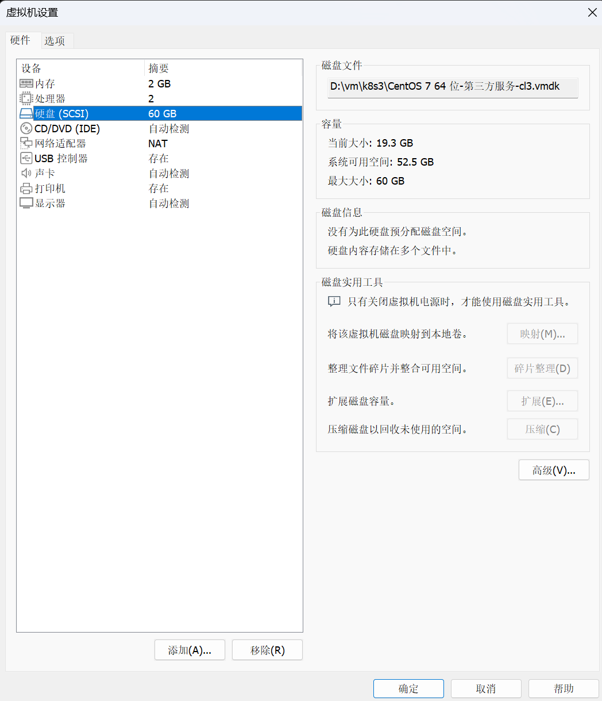

#### 在vm中扩展磁盘后虚拟机内部磁盘容量没有变化?




从你的输出可以确认，虚拟磁盘的总大小已经成功扩展到 **64.4 GB**，但现有分区 `/dev/sda3` 仍然只占用到 **41943039 扇区**（约 18.5 GB）。剩余的未分配空间从 **41943040 扇区** 开始，仍未被分区或使用。

以下是如何调整分区和文件系统来利用新增磁盘空间的完整步骤：

------

### **方案 1：扩展现有分区 `/dev/sda3`**

1. **启动 `fdisk` 工具：**

   ```bash
   fdisk /dev/sda
   ```

2. **删除现有分区 `/dev/sda3`：**

   - 输入 `d`。
   - 选择分区编号 `3`（即 `/dev/sda3`）。

   **注意：删除分区时不会删除分区中的数据，数据仍然安全，只要重新创建分区的起始扇区与原来一致。**

3. **重新创建分区 `/dev/sda3`：**

   - 输入 `n` 创建新分区。
   - 选择 `p` 创建主分区。
   - 选择分区编号 `3`。
   - 起始扇区：输入 **4810752**（原来的起始扇区）。
   - 结束扇区：直接按回车使用默认值（覆盖所有剩余空间）。

4. **验证分区布局：**

   - 输入 `p` 查看新的分区布局，确保 `/dev/sda3` 已扩展。

5. **保存并退出：**

   - 输入 `w` 写入更改并退出。

6. **刷新分区表：** 如果提示重启系统，可运行以下命令刷新分区表：

   ```bash
   partprobe
   ```

7. **扩展文件系统：**

   - 如果 

     ```
     /dev/sda3
     ```

      使用的是 

     ```
     ext4
     ```

      文件系统：

     ```bash
     resize2fs /dev/sda3
     ```

   - 如果使用的是 

     ```
     xfs
     ```

      文件系统：

     ```bash
     xfs_growfs /dev/sda3
     ```

8. **验证结果：** 运行以下命令确认扩展后的分区大小：

   ```bash
   df -h
   ```

------

### **方案 2：创建新分区**

如果你不想扩展现有分区，可以利用剩余空间创建一个新的分区。

1. **启动 `fdisk`：**

   ```bash
   fdisk /dev/sda
   ```

2. **创建新分区：**

   - 输入 `n` 创建新分区。
   - 选择逻辑分区或主分区（建议主分区，如果主分区数量少于 4 个）。
   - 起始扇区：使用默认值（41943040）。
   - 结束扇区：直接按回车使用所有剩余空间。

3. **保存分区更改：** 输入 `w` 写入分区表并退出。

4. **创建文件系统：**

   - 如果需要将新分区 

     ```
     /dev/sda4
     ```

      格式化为 

     ```
     ext4
     ```

     ：

     ```bash
     mkfs.ext4 /dev/sda4
     ```

5. **挂载新分区：**

   - 创建挂载点：

     ```bash
     mkdir /mnt/newdisk
     ```

   - 挂载新分区：

     ```bash
     mount /dev/sda4 /mnt/newdisk
     ```

   - 永久挂载： 编辑 

     ```
     /etc/fstab
     ```

      文件，添加以下内容：

     ```
     /dev/sda4 /mnt/newdisk ext4 defaults 0 0
     ```

6. **验证挂载：** 运行以下命令查看新分区是否已挂载：

   ```bash
   df -h
   ```

------

### **推荐方案**

如果 `/dev/sda3` 是你的主要数据分区，推荐使用 **方案 1** 扩展分区，这样可以保持现有目录结构和文件不变。如果你需要单独的空间用于特定用途，可以选择 **方案 2** 创建新分区。

如果操作过程中遇到问题，请提供具体错误信息，我可以进一步协助！


现在，分区调整已经完成，但文件系统可能尚未扩展。如果运行 `df -h` 后发现磁盘容量未改变，需要执行最后一步来扩展文件系统。


从新的输出可以看到，你已经成功将 **/dev/sda3** 分区扩展到了整个磁盘空间，覆盖了新增的部分：

```plaintext
/dev/sda3         4810752   125829119    60509184   83  Linux
```

- **Start**: 4810752 （起始扇区保持不变）。
- **End**: 125829119 （扩展到了磁盘的最后一个扇区）。
- **Blocks**: 60509184（约 60GB）。

现在，分区调整已经完成，但文件系统可能尚未扩展。如果运行 `df -h` 后发现磁盘容量未改变，需要执行最后一步来扩展文件系统。

------

### **扩展文件系统**

#### **1. 检查文件系统类型**

运行以下命令确认 `/dev/sda3` 的文件系统类型：

```bash
blkid /dev/sda3
```

- 如果是 `ext4` 文件系统：

  ```bash
  resize2fs /dev/sda3
  ```

- 如果是 `xfs` 文件系统：

  ```bash
  xfs_growfs /dev/sda3
  ```

------

#### **2. 验证扩展**

扩展完成后，运行以下命令检查分区容量：

```bash
df -h
```

你应该能看到 `/dev/sda3` 的容量已经扩展到约 **60GB**。

------

如果还有问题，请随时告诉我，我可以进一步帮助！