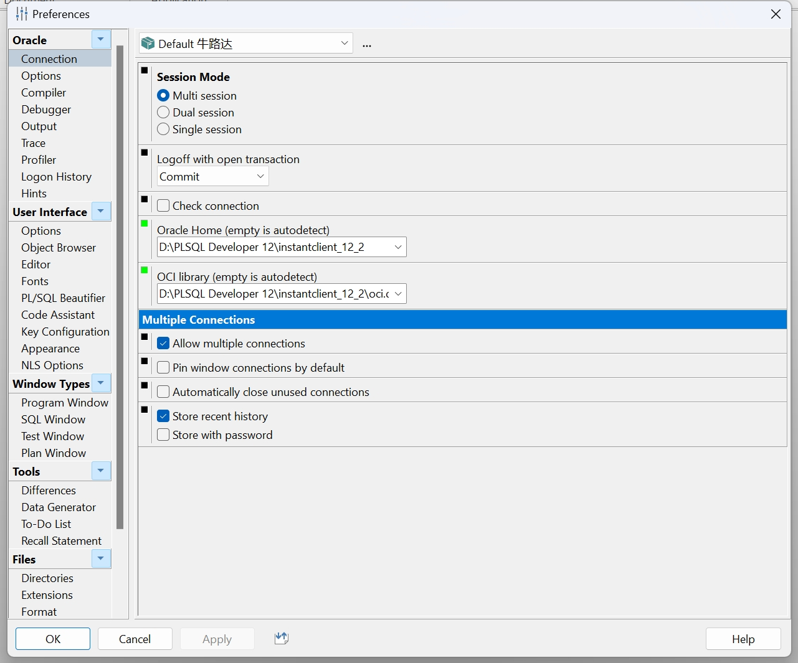

#### 1.下载instant-client()

```
https://www.oracle.com/database/technologies/instant-client/winx64-64-downloads.html
```

#### 2.解压到指定目录(instantclient_12_2)

```
D:\PLSQL Developer 12\instantclient_12_2
```

#### 3.新建network\ADMIN目录

```
instantclient_12_2\network\ADMIN
```

#### 4.进入容器查看数据库名称

```
docker exec -it oracle11g /bin/bash
bash-4.4$: sqlplus / AS SYSDBA(不能切换root 切换了会让你输入用户名和密码)
SQL>show parameter service_name
输出可知数据库用户名:FREE

NAME				     TYPE	 VALUE
------------------------------------ ----------- ------------------------------
service_names			     string	 FREE


```

#### 5.编辑之前建立好的 instantclient_12_2\network\ADMIN\tnsnames.ora 文件。内容如下：

```
test_docker_oracle=
(DESCRIPTION =
  (ADDRESS = (PROTOCOL = TCP)(HOST= 172.18.20.129)(PORT = 1521))
  (CONNECT_DATA =
    (SERVER = DEDICATED)
    (SERVICE_NAME = xe)
  )
)
HOST 为 Docker 在宿主机上的 IP 地址， SERVICE_NAME 是之前在 Docker 中 ORACLE 中查看得到的服务名
```

6.配置oci.dll

```
plsql-首选项-连接
```



#### 6.配置 Windows 环境变量。

ORACLE_HOME = D:\Develop\instantclient_19_8

TNS_ADMIN = %ORACLE_HOME%\network\admin

#### 7.**检查数据库字符集**

在 PL/SQL 中，可以用以下 SQL 查询数据库的字符集：

```
SELECT * FROM NLS_DATABASE_PARAMETERS WHERE PARAMETER = 'NLS_CHARACTERSET';

```

NLS_LANG = SIMPLIFIED CHINESE_CHINA.AL32UTF8

将 ORACLE_HOME 配置到 Path 变量中。

启动 PLSQL。此时登录画面可以选择的数据库选项有刚刚配置的 test_docker_oracle

登录成功，即连接成功。

